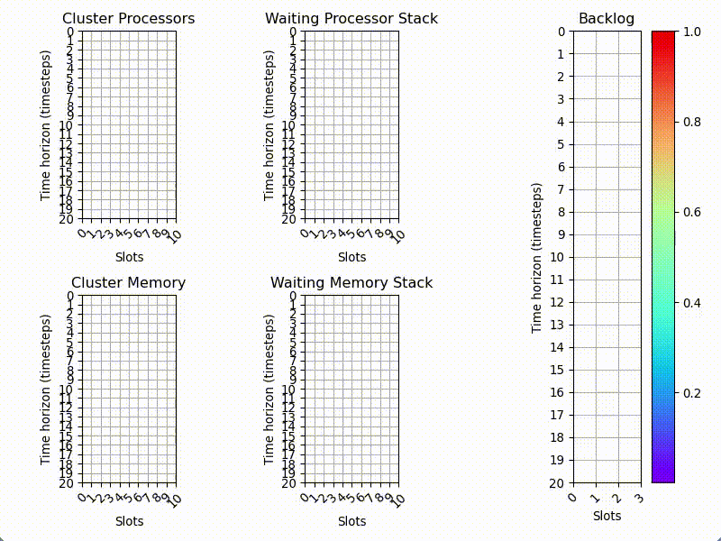

.. figure:: https://github.com/renatolfc/sched-rl-gym/workflows/sched-rl-gym/badge.svg
   :alt: sched-rl-gym

sched-rl-gym: Gym environment for HPC job scheduling problems
=============================================================

.. inclusion-marker-do-not-remove

``sched-rl-gym`` is an `OpenAI Gym <https://gym.openai.com>`__
environment for job scheduling problems. Currently, it implements `the
Markov Decision
Process <https://en.wikipedia.org/wiki/Markov_decision_process>`__
defined by
`DeepRM <https://people.csail.mit.edu/hongzi/content/publications/DeepRM-HotNets16.pdf>`__.

You can `use it as any other OpenAI Gym
environment <https://gym.openai.com/docs/>`__, provided the module is
registered. Lucky for you, it supports auto registration upon first
import.

Therefore, you can get started by importing the environment with
``import lugarrl.envs as schedgym``.

As a parallel with the CartPole example in the Gym documentation, the
following code will implement a random agent:

.. code:: python

   import gym
   import lugarrl.envs as schedgym

   env = gym.make('DeepRM-v0', use_raw_state=True)
   env.reset()

   for _ in range(200):
     env.render()
     observation, reward, done, info = env.step(env.action_space.sample())
   env.close()

With the following rendering:

   OpenAI Gym Environment rendering

Features
--------

-  OpenAI Gym environment
-  Human rendering
-  Configurable environment

Installation
------------

The easiest/quickest way to install sched-rl-gym is to use ``pip`` with
the command:

::

   pip install -e git+https://github.com/renatolfc/sched-rl-gym.git#egg=sched-rl-gym

We do recommend you use a `virtual
environment <https://docs.python-guide.org/dev/virtualenvs/>`__, to not
pollute your python installation with custom packages.

If you want to be able to edit the code, then your best bet is to clone
this repository with

::

   git clone https://github.com/renatolfc/sched-rl-gym.git

In this case, you will need to install the dependencies manually.

Dependencies
~~~~~~~~~~~~

The dependencies are documented in the ``requirements.txt`` file. You
can install them with

::

   pip install -r requirements.txt

Contribute
----------

-  Issue tracker: https://github.com/renatolfc/sched-rl-gym/issues
-  Source code: https://github.com/renatolfc/sched-rl-gym

Support
-------

If you’re having issues, please let us know. The easiest way is to `open
an issue on
github <https://github.com/renatolfc/sched-rl-gym/issues>`__.

License
-------

The project is licensed under the MIT license.
