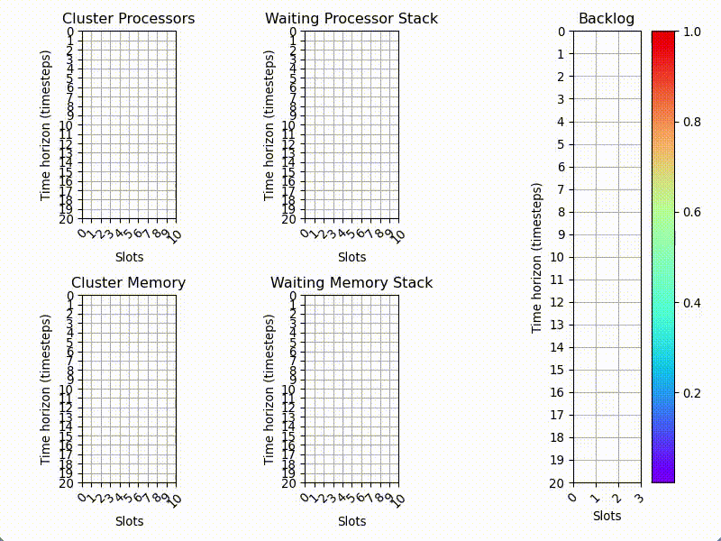

.. image:: https://github.com/renatolfc/sched-rl-gym/workflows/sched-rl-gym/badge.svg
   :alt: sched-rl-gym
.. image:: https://coveralls.io/repos/github/renatolfc/sched-rl-gym/badge.svg?branch=master
   :target: https://coveralls.io/github/renatolfc/sched-rl-gym?branch=master
.. image:: https://readthedocs.org/projects/sched-rl-gym/badge/?version=latest
   :target: https://sched-rl-gym.readthedocs.io/en/latest/?badge=latest
   :alt: Documentation Status

sched-rl-gym: Gymnasium environment for HPC job scheduling problems
====================================================================

.. inclusion-marker-do-not-remove

``sched-rl-gym`` is a `Gymnasium <https://gymnasium.farama.org/>`__
environment for job scheduling problems. Currently, it implements `the
Markov Decision
Process <https://en.wikipedia.org/wiki/Markov_decision_process>`__
defined by
`DeepRM <https://people.csail.mit.edu/hongzi/content/publications/DeepRM-HotNets16.pdf>`__.

You can `use it as any other Gymnasium
environment <https://gymnasium.farama.org/content/basic_usage/>`__, provided the module is
registered. Lucky for you, it supports auto registration upon first
import.

Therefore, you can get started by importing the environment with
``import schedgym.envs as schedgym``.

As a parallel with the CartPole example in the Gymnasium documentation, the
following code will implement a random agent:

.. code:: python

   import gymnasium
   import schedgym.envs as schedgym

   env = gymnasium.make('DeepRM-v0', use_raw_state=True)
   obs, info = env.reset()

   for _ in range(200):
     env.render()
     obs, reward, terminated, truncated, info = env.step(env.action_space.sample())
     if terminated or truncated:
       obs, info = env.reset()
   env.close()

With the following rendering:

   Gymnasium Environment rendering

Features
--------

-  Gymnasium environment
-  Human rendering
-  Configurable environment

Installation
------------

The recommended way to install sched-rl-gym is to use ``uv``:

::

   uv pip install git+https://github.com/renatolfc/sched-rl-gym.git

Alternatively, you can use ``pip``:

::

   pip install git+https://github.com/renatolfc/sched-rl-gym.git

We recommend using a `virtual
environment <https://docs.python-guide.org/dev/virtualenvs/>`__ to not
pollute your python installation with custom packages.

If you want to be able to edit the code, then your best bet is to clone
this repository with

::

   git clone https://github.com/renatolfc/sched-rl-gym.git

Then install it in editable mode:

::

   uv pip install -e ".[test]"

Dependencies
~~~~~~~~~~~~

Dependencies are managed through ``pyproject.toml``. They will be
installed automatically when you install the package.

Contribute
----------

-  Issue tracker: https://github.com/renatolfc/sched-rl-gym/issues
-  Source code: https://github.com/renatolfc/sched-rl-gym

Support
-------

If you're having issues, please let us know. The easiest way is to `open
an issue on
github <https://github.com/renatolfc/sched-rl-gym/issues>`__.

License
-------

The project is licensed under the MIT license.
